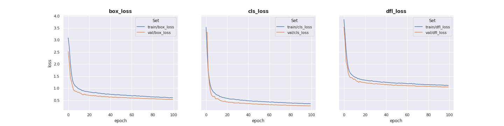

# Face-Object-Detection

Face detection model train with model **YOLOv8**
# Trained model

The model was trained using a NVIDIA GeForce GTX 1070. 
An example using the trained model on images from the validation set is shown below.

&nbsp;


## Dataset and preprocessing tools

[FDDB (Face Detection Data Set)](http://vis-www.cs.umass.edu/fddb/) was used to train the model. The script tools/preprocess_dataset.py process and transform images and labels to the yolov8 dataset format.

```
./tools/preprocess_dataset.py --dataset_root_path --save_root_path
```

## Training metrics 
Training metrics are shown bellow with P, R, F1 and PR curves.
<p align="middle">
 

</p>

<p align="middle">
 

</p>

<p align="middle">


</p>
